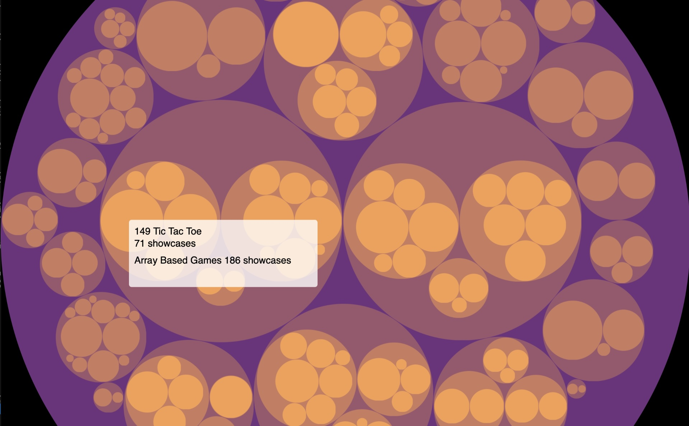

# Circle Packing Diagram in p5.js using d3.js

When Daniel Shiffman did an [Apollonian Gasket Coding Challenge](https://thecodingtrain.com/challenges/182-apollonian-gasket) in honor of Pi day this year, I created some [generative art](https://github.com/kfahn22/Apollonian-Gasket) based of his code. You can also use the circle-packing algorithm is the visualize data. I have already created a [treemap](https://github.com/kfahn22/Treemap-of-Coding-Train-Challenges) of Coding Challenge showcases. The treemap algorithm is a more efficient use of space, but the circle packing diagram might provide more visual information about the relationships between the nodes.

I am utilizing the [d3-pack](https://d3js.org/d3-hierarchy/pack) library to create the circle-packing diagram. You will need to add the d3.js library in the index.html file.

```html
<script src="https://cdn.jsdelivr.net/npm/d3@7.9.0/dist/d3.min.js"></script>
```

## Preload the json file into your p5 sketch

For more information about how the `showcase.json` file was generated, please refer to the discussion in the the Treemap repo referenced above.

```JavaScript
function preload() {
  data = loadJSON("showcases.json");
}
```

## Initialize the d3 hierarchy and call pack()

```JavaScript
  root = d3.pack(data).size([width, height]).padding(1)(
    d3
      .hierarchy(data)
      .sum((d) => d.value)
      .sort((a, b) => b.value - a.value)
  );
```

I am using the p5.js `lerpColor()` function to interpolate between two colors based on the depth of the node (0-3 for this data structure).

```JavaScript
function assignColor(node, color1, color2) {
  let depth = node.depth;
  let amt = depth / 3;
  return lerpColor(color1, color2, amt);
}
```

The d3.js [examples](https://observablehq.com/@d3/pack-component) use a svg container, which is not something that is natively supported in p5.js. While I don't believe it is absolutely necessary, I used a graphics buffer to render the circle packing diagram. I retrieved the center and radius of each node circle (x, y, r). I then used the radius to determine the width and height of the bounding box of the circle to pass to the graphics buffer.

```JavaScript
let { x, y, r } = node;
    let w = 2 * r;
    let h = 2 * r;
```

It should be noted that we need to pass the top, left corner of the graphics buffer, which is (x-r, y-r) as well as the node data. One thing that is potentially confusing about working with the d3 library is the data structure that is returned. To retrieve the name of the node, you must indicate `node.data.name`, while for other variables including `data` results in an error. I recommend using console.log(root) to examine the data structure if you are having issues.

```JavaScript
graphics.push({
      buffer: buffer,
      x: x - r,
      y: y - r,
      w: w,
      h: h,
      node: node
    });
```

## Popups

Because there are too many--in some cases very small--circles to make it practical to add all of the node names, I am using a popup window to provide the challenge name and showcase count. We use `dist()` to determine when the mouse is inside the node circle.

```JavaScript
let d = dist(mouseX, mouseY, node.x, node.y);
```

Since some of the nodes have children, we first determine whether the mouse is in a child (subchild). If it is, we add a popup for the child (subchild). Otherwise, we add a popup for the node.

<p align="center"></p>

You can explore the circle packing diagram [here](https://editor.p5js.org/kfahn/full/gp7zqBB9D).
